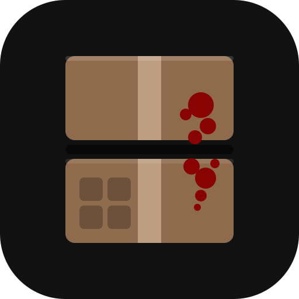

<p align="center"></p>

# ZomboidDS

Nintendo DS-style dual-screen play for Project Zomboid on handhelds like the AYN Thor. The game
runs on the top screen (through [Zomdroid](https://github.com/udarmolota/zomdroid)); the
**ZomboidDS Companion** app on the bottom screen, in the game's own art:

- **Inventory**: your bags and every container around you, with the game's icons; move items with a
  tap, and use them through the game's own item menu (read, eat, apply, craft, ...).
- **Deck**: the game's speed buttons, and what you can do where you stand (open, sit, drink, ...).
- **Status**: the game's moodles, your body with its injuries, and the game's treatments.
- **Craft**: the recipes you can make with what's in reach, what each needs, and crafting them.
- **Vehicle**: speed, fuel and engine while you drive.

## Download

Get `ZomboidDS-<version>.apk` from the [latest release](https://github.com/Space001000/ZomboidDS/releases/latest)
and follow the [user guide](docs/USER_GUIDE.md): the app's setup checklist installs the mod for you,
and later tells you when there's a new version.

You need your own copy of **Project Zomboid (Build 42)**, running in
[udarmolota's Zomdroid](https://github.com/udarmolota/zomdroid). ZomboidDS is an unofficial mod,
not affiliated with or endorsed by The Indie Stone.

## Support

ZomboidDS is free and stays free: donations never unlock anything. If it makes your runs better and
you'd like to say thanks: [ko-fi.com/space000](https://ko-fi.com/space000).

## What it can access

- **The game, on the same device only.** The mod's bridge listens on `127.0.0.1` (loopback), so
  nothing else on your network can reach it; the app connects to it there and nowhere else. Release
  builds allow unencrypted traffic to `127.0.0.1` alone
  ([network_security_config.xml](companion-app/src/main/res/xml/network_security_config.xml)).
- **GitHub, for downloads.** The setup checklist asks this repository's releases whether there's a
  newer version of the app (at most once a day, while the checklist is on screen) and downloads it
  when you tap Download. It can also download ZombieBuddy from
  [its own GitHub releases](https://github.com/zed-0xff/ZombieBuddy/releases) when you ask (a pinned
  version, checked against SHA-256 hashes built into the app). Nothing else is downloaded or sent;
  no analytics, no accounts.
- **Permissions:** `INTERNET` (needed for all of the above, even the local connection); installing
  apps (`REQUEST_INSTALL_PACKAGES`), only used to hand a downloaded update to Android's installer,
  which asks you first and only accepts an update signed with the same key; and seeing whether
  Zomdroid (`com.zomdroid`) is installed. No storage permission: the mod is installed through
  Android's folder picker, into the folder you choose, and the ZombieBuddy download is saved to
  Downloads.

## How it was made

ZomboidDS was written with [Claude Code](https://claude.com/claude-code), Anthropic's AI coding
agent, directed and reviewed by me (Space000, a software developer), and tested on a real AYN Thor
throughout. How the game works was checked against its own files rather than guessed; the design
and those findings are in [docs/DESIGN.md](docs/DESIGN.md).

## How it fits together

```
Top screen: Zomdroid → Project Zomboid (B42)
  ├─ ZombieBuddy (Java mod loader, installed by the user through Zomdroid)
  └─ ZomboidDS mod
       ├─ Java (bridge/): WebSocket + HTTP server on 127.0.0.1:7786
       └─ Lua (mod/):     reads game state, runs commands on the game thread
Bottom screen: ZomboidDS Companion (companion-app/), Kotlin + Compose
```

The two sides only share [the protocol](protocol/PROTOCOL.md). Everything game-version specific
lives in adapters (`bridge/adapter-b42`, `mod/ZomboidDS/42/`), so another build (e.g. B41) is an
added adapter, not a change to the core or the app.

| Folder | What |
|---|---|
| `protocol/` | Protocol spec and example messages, used as test fixtures by both sides |
| `bridge/core` | Version-neutral server: state hub, command queue, icon extraction from `.pack` files |
| `bridge/adapter-b42` | B42 adapter + ZombieBuddy entry point; builds `ZomboidDS.jar` and the mod zip |
| `bridge/mock-server` | The real bridge with a fake game, for app development and end-to-end tests |
| `mod/ZomboidDS` | The mod: Lua core in `common/`, B42 adapter and `mod.info` in `42/` |
| `mod/test` | Lua tests against a fake game |
| `companion-app` | The Android app, including the setup wizard that installs the mod |
| `tools` | Dev scripts |

## Building

Requirements:

- Android Studio (or the Android SDK) and a JDK 21+ to run Gradle.
- A **JDK 25** for the bridge: 42.20's class files need it. Gradle finds one installed by
  IntelliJ/Android Studio (`~/.jdks`), or downloads it.
- **Project Zomboid (B42)** on the build machine; the bridge compiles against its
  `projectzomboid.jar`. Put the folder that contains it in `local.properties` (not committed):

  ```properties
  pz.gameDir=C\:/Steam/steamapps/common/ProjectZomboid
  ```

Then:

```bash
./gradlew :companion-app:assembleDebug
```

This also builds the mod zip (`bridge/adapter-b42/build/distributions/ZomboidDS.zip`) and bundles
it into the APK. ZombieBuddy isn't bundled: the app downloads the version pinned in
`gradle.properties` from ZombieBuddy's GitHub when the user asks, and checks its hashes.

Release builds (`./gradlew :companion-app:assembleRelease`) are shrunk with R8 and signed with the
key described by a `keystore.properties` in the project root (`storeFile`, `storePassword`,
`keyAlias`, `keyPassword`; never committed). Without it they build unsigned. Updates only install
over an app signed with the same key, so releases must always use the same one.

## Tests

```bash
./gradlew :bridge:core:test :bridge:adapter-b42:test :companion-app:testDebugUnitTest
pip install lupa && python tools/test-lua.py
```

- `bridge/*`: server, state hub, protocol codec, `.pack` reader, Kahlua conversion (against the
  game's real Kahlua classes).
- `companion-app`: protocol mapping, inventory stacking, mod list editing, ZombieBuddy packaging,
  and end-to-end tests of the app's gateway against the real bridge with the mock game.
- `mod/test`: the Lua core and B42 adapter against a fake of the game's API.

## Developing on a device

- **App against a fake game:** `./gradlew :bridge:mock-server:run` on the PC, then
  `adb reverse tcp:7786 tcp:7786` so the app on the device reaches it on `127.0.0.1`. The console
  lets you change the fake game (enter/leave a vehicle, take damage, add items). Add
  `-Pmock.args="inventory=full,gameDir=<PZ folder>"` for a 64-item inventory with the game's real
  icons. The emulator works too: set it to the Thor's bottom screen (landscape) with
  `adb shell wm size 1240x1080` and `adb shell wm density 369`. When a Thor is also connected, run
  the mock on another port (`-Pmock.args=port=7787,...`) and `adb -s emulator-5554 reverse tcp:7786
  tcp:7787`, so the Thor's `adb forward` on 7786 keeps working. Stopping the Gradle task can leave the
  mock's `java.exe` running and holding the port: end it before starting a new one.
- **Icons look stale or missing in the app:** icons are cached on disk (Coil). A debug build logs
  every failed icon (logcat tag `RealImageLoader`); `adb shell run-as dev.zomboidds.companion rm -rf
  cache/icons` clears the cache.
- **Talk to the game without the app:** `adb forward tcp:7786 tcp:7786`, then
  `python tools/bridge-client.py` lists the containers around the player and moves items
  (`take`, `put`, `takeall`).
- **Mod changes on the device:** `tools/deploy-mod.sh` builds the mod and installs it into Zomdroid
  through the companion app (which holds the folder permission; grant it once in the app).
  Restart the game afterwards. The mod's log goes to logcat under the tag `zomdroid-main`
  (look for `[ZomboidDS]`).
- On the AYN Thor the bottom screen is display 4:
  `adb shell am start --display 4 -n dev.zomboidds.companion/.MainActivity`.

## Credits

- [Zomdroid](https://github.com/udarmolota/zomdroid) runs Project Zomboid on Android.
- [ZombieBuddy](https://github.com/zed-0xff/ZombieBuddy) (MIT) loads the mod's Java code and
  exposes it to Lua.

Not affiliated with The Indie Stone. ZomboidDS ships no game files; icons are read from the
player's own installation on their device.

## Licence

ZomboidDS is free software under the [GNU General Public License v3.0](LICENSE): you may use, study,
share and change it, and versions you distribute must stay under the same licence. The open-source
software it includes, and their licences, are listed in [THIRD_PARTY_NOTICES.md](THIRD_PARTY_NOTICES.md)
(also in the app: About → Open-source licences).
